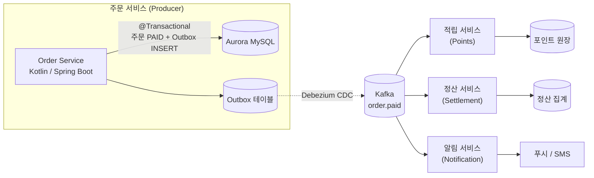

# Kafka 메시지 전송 보장(Delivery Semantics) 제대로 이해하기 — exactly-once는 정말 가능한가?

> at-most-once / at-least-once / exactly-once를 실무 관점에서 정직하게 비교하고, 주문 결제 이벤트 파이프라인을 예로 "내 로직이 정말 그 보장을 지키고 있는지"를 실증적으로 검증해 본 기록.

## 1. 들어가며: 전송 보장은 "한 군데"의 문제가 아니다

이벤트 기반 아키텍처에서 "메시지를 정확히 한 번 처리한다"는 말은 직관적으로 들리지만, 실제로는 세 개의 독립적인 구간이 곱해진 결과다.

**전송 보장(delivery semantics) = (프로듀서 → 브로커 구간) × (브로커의 내구성) × (브로커 → 컨슈머 구간)**

각 구간에서 메시지는 유실되거나 중복될 수 있고, 우리가 흔히 말하는 at-most-once / at-least-once / exactly-once는 이 세 구간을 종합한 *end-to-end* 속성이다. 한쪽만 exactly-once로 설정한다고 전체가 exactly-once가 되지는 않는다 — 이게 이 글에서 가장 하고 싶은 이야기다.

## 2. 세 가지 전송 보장 방식

### at-most-once (최대 한 번)

중복 없이 최대 한 번만 전달되며, 대신 유실이 허용된다. 프로듀서는 `acks=0`로 브로커 응답을 기다리지 않고 던지거나(fire-and-forget) 재시도를 두지 않는다 — 가장 빠르지만 네트워크 오류가 나면 메시지는 그대로 사라진다. 컨슈머는 처리하기 *전에* 오프셋을 먼저 커밋한다(commit-then-process). 커밋 직후 장애가 나면 그 메시지는 다시 읽히지 않으므로 유실된다. `enable.auto.commit=true`로 백그라운드 자동 커밋이 처리 완료 전에 일어나는 경우가 대표적인 함정이다. 유실 비용이 낮고 처리량이 중요한 지표·일부 로그·실시간 대시보드용 샘플 데이터에 적합하다.

### at-least-once (최소 한 번)

유실 없이 최소 한 번 전달되며, 대신 중복이 허용된다. 프로듀서는 `acks=all`과 재시도를 켜서 브로커가 복제까지 확인한 뒤에야 ack를 받는데, 이 ack가 유실되면 프로듀서가 같은 메시지를 다시 보내 중복이 생긴다. 컨슈머는 처리를 *끝낸 뒤에* 오프셋을 커밋한다(process-then-commit). 처리는 됐는데 커밋 전에 장애나 리밸런스가 나면 같은 메시지를 다시 읽어 재처리한다. 이 방식이 사실상 기본값이자 실무의 주력이고, 중복을 피할 수 없으므로 **컨슈머를 멱등(idempotent)하게 설계하는 것이 정답**이 된다.

### exactly-once (정확히 한 번)

유실도 중복도 없이 정확히 한 번 처리된 효과를 내지만, 결정적인 단서가 붙는다. 프로듀서 멱등성(`enable.idempotence=true`)은 같은 파티션으로의 재전송을 브로커가 PID + 시퀀스 번호로 걸러내 *프로듀서 → 브로커* 구간의 중복을 제거한다(Kafka 3.0+ 클라이언트는 기본 활성화). 여기에 트랜잭션(`transactional.id`)을 더하면 여러 파티션/토픽 쓰기와 컨슈머 오프셋 커밋까지 **하나의 원자적 단위**로 묶여, "읽고 → 처리하고 → 다시 Kafka에 쓰는" read-process-write 패턴에서 exactly-once가 성립한다(컨슈머는 `isolation.level=read_committed`로 커밋된 것만 읽어야 한다). 단서는 이것이 ***Kafka 안에서만*** 성립한다는 점이다 — 처리 도중 Aurora MySQL INSERT, 푸시 발송, 외부 API 호출처럼 외부 시스템을 건드리면 Kafka 트랜잭션은 그 효과까지 묶지 못한다. 이종(heterogeneous) 시스템에 걸친 진짜 분산 exactly-once는 사실상 불가능에 가깝다.

| 구분 | 유실 | 중복 | 처리량 / 지연 | 대표 설정 | 적합한 곳 |
|---|:---:|:---:|---|---|---|
| at-most-once | 가능 | 없음 | 가장 좋음 | `acks=0`, commit-then-process | 지표, 비핵심 로그 |
| at-least-once | 없음 | 가능 | 보통 | `acks=all`, process-then-commit | 대부분의 비즈니스 이벤트 (+ 멱등 컨슈머) |
| exactly-once | 없음 | 없음 | 가장 무거움 | 멱등 프로듀서 + 트랜잭션, `read_committed` | Kafka 내부 스트림 처리, 금전과 직결되는 집계 |

## 3. 예제: 주문 결제 이벤트 파이프라인

우리 서비스는 Kotlin + Spring Boot 기반의 주문 시스템이고, 상태는 Aurora MySQL에 저장하고 이벤트는 Apache Kafka에 싣는다. 컨슈머들은 EKS 위에서 컨슈머 그룹으로 동작한다.

결제가 완료되면 `order.paid` 토픽에 `OrderPaid` 이벤트가 발행되고, 세 종류의 다운스트림이 이를 구독한다.



핵심은 **한 서비스 안에서도 스트림마다 필요한 보장 수준이 다르다**는 점이다. 이걸 하나의 전역 설정으로 뭉뚱그리지 않는 것이 이 설계의 출발점이다.

## 4. 스트림마다 다른 보장을 요구한다

| 다운스트림 | 중복의 결과 | 유실의 결과 | 목표 보장 |
|---|---|---|---|
| 적립(Points) | 포인트 이중 적립 = 금전 사고 | 적립 누락 = CS / 보상 | at-least-once + **멱등** (효과상 exactly-once) |
| 정산(Settlement) | 매출 과대 집계 | 매출 과소 집계 | exactly-once 수준의 정합성 |
| 알림(Notification) | 푸시 중복 (거슬리지만 치명적이지 않음) | 푸시 누락 (아쉽지만 허용 가능) | at-least-once, 중복은 짧은 윈도우 dedup으로 완화 |
| 지표(Metrics) | 미미 | 데이터 포인트 1개 손실 (허용) | at-most-once로 충분 |

적립은 절대 두 번 일어나면 안 되지만, 그렇다고 외부 DB까지 EOS로 묶을 수는 없으니 전송은 at-least-once로 받고 컨슈머에서 멱등하게 만들어 "효과상 exactly-once"를 달성한다. 정산은 금액 합계의 정합성이 생명이라 가장 엄격하다 — 집계가 Kafka 안에서 닫힌다면 Kafka Streams의 EOS(read-process-write)를 쓰고, 외부 집계 테이블에 쓴다면 역시 멱등 upsert로 맞춘다. 알림은 한 번 더 가도 치명적이지 않지만 사용자 경험상 거슬리므로 Redis/Valkey에 발송 키(eventId)를 짧은 TTL로 남겨 중복 발송을 줄인다. 지표는 유실돼도 통계적으로 무의미하므로 가장 가벼운 경로로 보낸다.

## 5. "내 로직이 정말 보장하고 있는가?" — 구체적·실증적 검증

여기가 핵심이다. 설정값을 박아뒀다고 보장이 되는 게 아니라, **중복/유실이 실제로 발생하는지, 그리고 내 코드가 그걸 실제로 걸러내는지**를 눈으로 확인해야 한다.

### 5-1. 프로듀서 측: dual-write 문제와 Outbox

가장 흔한 함정은 "DB 커밋 후 Kafka 발행"이라는 이중 쓰기(dual-write)다. 둘은 원자적이지 않다.

```kotlin
// 안티패턴: DB와 Kafka가 한 트랜잭션이 아니다
@Transactional
fun completePayment(order: Order) {
    order.markPaid()
    orderRepository.save(order)            // (1) 트랜잭션 커밋됨
    kafkaTemplate.send("order.paid", ev)   // (2) 여기서 장애 → 이벤트 영구 유실
}
```

(1)과 (2) 사이에서 프로세스가 죽으면 주문은 `PAID`인데 이벤트는 영영 안 나간다 → 다운스트림은 적립을 못 한다.

**실증 실험.** 위 코드에서 (1) 직후 `throw RuntimeException()`을 강제로 넣거나 브로커를 잠깐 내려 `send`를 실패시켜 보라. Aurora에는 `PAID` 주문이 남지만 `order.paid` 토픽에는 메시지가 없다 — 이게 dual-write 유실의 실체다.

해결은 **Transactional Outbox + Debezium CDC**다.

```kotlin
@Transactional
fun completePayment(order: Order) {
    order.markPaid()
    orderRepository.save(order)
    outboxRepository.save(
        OutboxEvent(
            aggregateType = "Order",
            aggregateId = order.id,
            eventType = "OrderPaid",
            payload = objectMapper.writeValueAsString(OrderPaidEvent.from(order)),
        )
    )
    // Kafka 직접 발행 없음. Debezium이 outbox 테이블을 tail 해서 Kafka로 흘려보낸다.
}
```

주문 상태 변경과 outbox 적재가 **하나의 DB 트랜잭션**이므로 "DB엔 있는데 이벤트는 없는" 구멍이 사라진다. 다만 outbox → Kafka 구간은 Debezium이 at-least-once로 보장한다(커넥터 재시작 시 중복 가능). 그래서 컨슈머 멱등성이 또 필요하다.

프로듀서 멱등성/내구성 설정:

```yaml
spring:
  kafka:
    producer:
      acks: all
      properties:
        enable.idempotence: true                  # PID + sequence로 재전송 중복 제거
        max.in.flight.requests.per.connection: 5  # 멱등성 보장을 위한 상한
        retries: 2147483647                       # delivery.timeout.ms가 실질 상한을 잡음
```

**검증 포인트.** 프로듀서 메트릭의 `record-retry-rate`, `record-error-rate`를 본다. 재전송이 일어나도 `enable.idempotence=true` 덕에 같은 레코드가 브로커에 중복 기록되지 않는다(시퀀스 번호로 거름). 만약 `OutOfOrderSequenceException`이 보이면 멱등성 전제(in-flight ≤ 5 등)가 깨진 것이니 점검한다.

### 5-2. 컨슈머 측: 멱등성을 코드가 아니라 DB로 강제한다

at-least-once 컨슈머는 중복을 피할 수 없다. 그래서 적립 원장에 **`event_id` 유니크 제약**을 걸어 멱등성을 *애플리케이션 코드가 아니라 DB가* 보장하게 한다.

```kotlin
@Transactional
fun accrue(event: OrderPaidEvent) {
    // point_ledger(event_id UNIQUE) — 중복 INSERT는 DB가 거부한다
    pointLedgerRepository.save(
        PointLedger(eventId = event.eventId, userId = event.userId, amount = event.points)
    )
    userPointRepository.addPoints(event.userId, event.points)
}
```

```kotlin
@KafkaListener(topics = ["order.paid"], groupId = "points-service")
fun handle(record: ConsumerRecord<String, OrderPaidEvent>, ack: Acknowledgment) {
    val event = record.value()
    try {
        pointsService.accrue(event)
        ack.acknowledge()                 // 처리 성공 후에만 커밋 = at-least-once
    } catch (e: DuplicateKeyException) {
        meterRegistry.counter("points.event.duplicate").increment()
        log.info("이미 처리된 이벤트 스킵: {}", event.eventId)
        ack.acknowledge()                 // 중복은 정상 스킵 처리
    }
}
```

```yaml
spring:
  kafka:
    consumer:
      enable-auto-commit: false
      isolation-level: read_committed     # 프로듀서 트랜잭션을 쓰는 경우 커밋된 것만 읽기
    listener:
      ack-mode: manual
```

**여기서부터가 "실증적"이다.**

1. **중복은 진짜로 온다 — 그걸 측정하라.** `points.event.duplicate` 카운터를 Grafana에 띄워두면, 이 값이 0보다 크다는 것 자체가 "at-least-once가 중복을 만들고 있고, 내 멱등 로직이 그걸 막고 있다"는 실증 증거다. Aurora 에러 로그에서 `Duplicate entry '...' for key 'uk_event_id'`를 직접 확인할 수도 있다.

2. **장애를 일부러 주입하라.** 컨슈머가 배치를 처리하는 중(ack 전)에 `kubectl delete pod points-service-xxx`로 파드를 죽인다. 재시작하면 커밋되지 않은 오프셋부터 다시 읽어 같은 이벤트가 재배달된다 → **포인트 원장 건수가 그대로인지**(이중 적립이 없는지) 확인한다. 멱등성이 살아있다면 원장 row 수는 안 변하고 duplicate 카운터만 올라간다.

3. **리밸런스를 일부러 유발하라.** `kubectl scale deploy points-service --replicas=4`로 파티션 재할당을 일으키면 in-flight 레코드가 재처리될 수 있다. 같은 방식으로 이중 적립이 없는지 검증한다.

4. **DLT와 컨슈머 랙을 감시하라.** 재시도 후에도 실패한 메시지는 DLT(`order.paid.DLT`)로 떨어진다. DLT 적재 건수와 컨슈머 그룹 랙(`kafka-consumer-groups.sh --describe` 또는 Burrow/Grafana)을 알람으로 묶어두면, 보장이 깨지기 시작하는 시점을 실시간으로 포착할 수 있다. 재시도/DLT를 선언적으로 프레임워크에 맡기려면 리스너를 이렇게 둘 수도 있다(이 모드에서는 재시도 토픽으로의 전달과 커밋을 프레임워크가 관리한다).

```kotlin
@RetryableTopic(
    attempts = "4",
    backoff = Backoff(delay = 1000, multiplier = 2.0),
    dltStrategy = DltStrategy.FAIL_ON_ERROR,
)
@KafkaListener(topics = ["order.paid"], groupId = "points-service")
fun handle(event: OrderPaidEvent) {
    pointsService.accrue(event)   // 멱등성은 여전히 DB 유니크 제약이 보장
}
```

### 5-3. 최종 방어선: 정합성 검증 배치

설정과 멱등성으로도 빠져나가는 케이스는 있다. 그래서 **end-to-end 정합성을 주기적으로 대조**한다(예: Spring Batch 야간 잡).

> Aurora의 모든 `PAID` 주문에 대해 대응하는 포인트 원장 엔트리가 존재하는가? 불일치 건수 = 실제로 새어나간 전송 실패다.

이 배치가 잡아내는 불일치 건수야말로 "내 파이프라인이 실제 운영에서 얼마나 보장을 지키는가"에 대한 가장 정직한 숫자다. 0이면 안심, 0이 아니면 어느 구간에서 샜는지 원인을 추적한다.

## 6. exactly-once에 대한 오해와 정직한 결론

"exactly-once 설정 하나면 끝"이라는 생각은 환상이다. Kafka의 EOS는 read-process-write가 전부 Kafka 안에서 닫힐 때 성립하고, 처리 중에 외부 DB·푸시·외부 API가 끼면 그 효과까지는 묶이지 않는다. 그래서 외부 시스템이 끼는 현실적인 파이프라인에서 실무의 정답은 대체로 **"at-least-once 전송 + 멱등 컨슈머 = 효과상 exactly-once"**다. 대부분의 팀이 실제로 굴리는 방식이기도 하다.

보장은 공짜가 아니라는 점도 분명히 해야 한다. 강한 보장일수록 지연·처리량·복잡도를 대가로 내준다. Kafka 트랜잭션은 코디네이션 비용과 `read_committed`로 인한 지연이 붙는다. 그래서 전역으로 EOS를 거는 대신 **스트림마다 비용 대비 필요한 만큼만** 선택하는 게 맞다. 결정의 축은 결국 "중복과 유실이 각각 비즈니스적으로 얼마나 비싼가"다 — 금전과 직결되면 멱등성으로 강하게, 유실 비용이 낮으면 at-most-once로 가볍게.

요약하면, "어떤 전송 보장을 쓰는가"라는 질문은 사실 **"이 스트림에서 중복과 유실은 각각 얼마나 비싼가, 그리고 나는 그걸 어떻게 실증적으로 확인하고 있는가"**라는 질문이다. 설정값이 아니라 검증 가능한 증거가 보장을 만든다.
